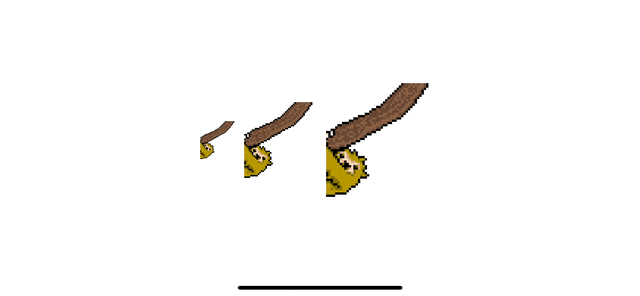

# NotAGif

For certain kinds animations it's not too uncommon to be exported as a series of single images.

They usually follow a naming scheme like: 
* `sloth_climb-0.png`
* `sloth_climb-1.png`
* `sloth_climb-2.png`
* ...
* `sloth_walk-0.png`
* `sloth_walk-1.png`
* ...

This package just offers the basic tools to render those!

* Written in SwiftUI
* Supports both macOS (NSImage) and iOS (UIImage)
* Supports custom file name formats
* Fps control



## Usage 

### <a id="Basics"></a>Basics

Assuming you want to render an animation composed of image frames (see example above):

``` swift
import SwiftUI
import NotAGif

struct ContentView: View {

    let framesProvider = FramesProvider(format: "%@-%d", fileExtension: .png, in: Bundle.main)

    var animationFrames: [UIImage] {
        framesProvider.frames(baseName: "sloth_climb")
    }

    var body: some View {
        AnimatedImage(frames: animationFrames, fps: 10)
    }
} 
```

### <a id="CustomViews"></a> Custom Views 

Let's say the images you want to render are in pixel art style, this generally requires to disable image interpolation.

Use `AnimatedContent` for custom rendering:

``` swift
import SwiftUI
import NotAGif

struct ContentView: View {

    let framesProvider = FramesProvider(format: "%@-%d", fileExtension: .png, in: Bundle.main)

    var animationFrames: [UIImage] {
        framesProvider.frames(baseName: "sloth_climb")
    }

    var body: some View {
        AnimatedContent(frames: animationFrames, fps: 10) { imageFrame in
            Image(frame: imageFrame)
                .interpolation(.none)
                .resizable()
                .aspectRatio(contentMode: .fill)
        }    
    }
} 
```

## Contents

### ImageFrame
Typealias for either UIImage or NSImage depending on the platform.

### AnimatedImage
View capable of rendering a given set of images with fps control. See [example](#Basics).

### AnimatedContent 
Can be used if you need custom rendering for image. See [example](#CustomViews).

### TimedContentProvider
Decides which frame is to be loaded given the time since the last update.

It is the underlying logic used to implement both `AnimatedImage` and `AnimatedContent`.

Use the `nextFrame(after:)` to get the next frame to be rendered, or nil if there are no changes.

Finally, you can set `onFirstFrameOfLoopLoaded` and `onLoopCompleted` if you need finer control over when a loop starts or ends.

The idea is that you can use if you need multiple animations in sync, already have a timer around your app (maybe a game?) or if you wish to do the rendering in some other way.
